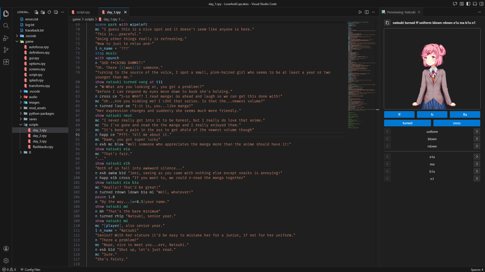

# vscode-mpt

Webview-based previewer for DDLC characters based on the Mood Pose Tool syntax — right in your code editor.
> This project is still early in development and my be subject to major changes.

</img>

## Features
- Realtime pose & expression previewing
- Uses your projects local installation (space-friendly and fast!)

## Prerequisites
Besides having a working [MPT](https://github.com/chronoshag/DDLCMPT) installation, please make *ABSOLUTELY* sure your file structure follows something like this:

```
YourDokiDokiMod/
├─ game/
│  ├─ script.rpy
│  ├─ mod_assets/
│  │  ├─ MPT/
```

The extension begins scanning from the currently opened folder - if you prefer having your `game` folder open instead, that works too.
For convenience, using the `Open Project Folder` button in the Ren'Py launcher is almost guarenteed to have the extension work as intended.

## Usage
To open a preview window:

1. Press `Ctrl + Shift + P` or whatever keybind to bring up the command palette. 
2. From here, search for `Start Previewing` or a Doki's name to have the option appear. 
3. Simply press enter and it will open a window to the right side of your editor.

## Current Limitations
There are numerous limitations with the project due to the static nature of its structure.

- No mood support.
- No custom layeredimage parsing.

## Planned Features
> These are not guaranteed by any means, but are taken into consideration as I develop the project further.

- Background support
- LayeredImage parsing
- Support for the original DDLC image syntax

## Acknowledgements

- [imjustaQ](https://github.com/ImJustAQ/) - QA tester and lots of invalulable feedback.
- [KaylaThePianist](https://github.com/KaylathePianist) - Preview Icon.
